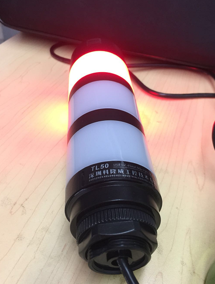
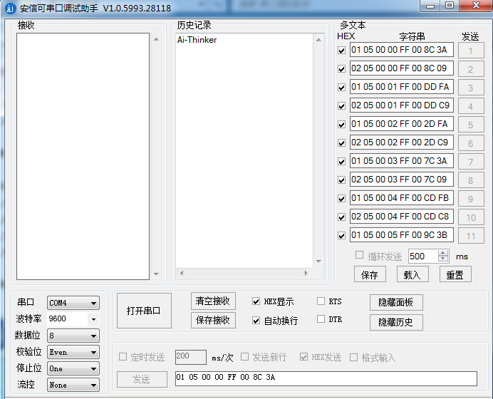
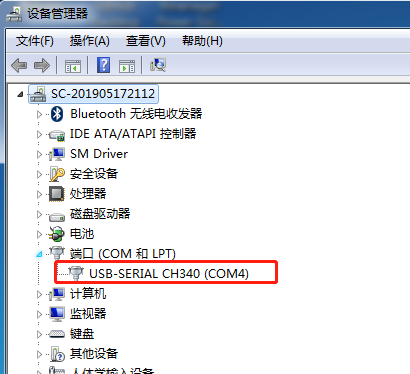

	
## 声光报警器接口
	

### 串口驱动安装
安装CH341SER_2.EXE
[CH341SER_2.rar](./resources/CH341SER_2.rar)

串口调试工具
[串口调试助手.rar](./resources/串口调试助手.rar)

安装成功能在设备管理器和串口调试工具中都能看COM串口的设备信息





### 参考代码

SerialPortDemo-master  小串口调试工具 
UsartTools-master.rar

### 指令
```
单层USB灯软件协议
一、串口通信定义
	串口波特率：9600   1位起始位、8位数据位 、1位停止位 、偶校验
	通讯接口：USB

 指令内容：
1、   01 05 00 00 ff 00 8c 3a      全灭
2、   01 05 00 01 ff 00 dd fa      黄灯亮
3、   01 05 00 02 ff 00 2d fa      绿灯亮
4、   01 05 00 03 FF 00 7c 3a     红灯亮
5、   01 05 00 04 FF 00 cd fb     蜂鸣器
6、   01 05 00 05 FF 00 9c 3b     红灯亮+蜂鸣器 删除


黄灯  	01050001FF00DDFA
绿灯  	01050002FF002DFA
红灯  	01050003FF007C3A
蜂鸣  	01050004FF00CDFB
关灯  	01050005FF009C3B
```


### 基于web页面调用
```
    $.ajax({
        url:"http://192.168.69.184:8081/led/alarmLed/open?alarmLevel=1&voice=0",
        success:function(data){
            console.log(data);
        }
    });
```


### Modbus两种协议的编程方法

```

Modbus两种协议的编程方法： 

1、LRC校验 
LRC域是一个包含一个8位二进制值的字节。LRC值由传输设备来计算并放到消息帧中，接收设备在接收消息的过程中计算LRC，并将它和接收到消息中LRC域中的值比较，如果两值不等，说明有错误。 
LRC校验比较简单，它在ASCII协议中使用，检测了消息域中除开始的冒号及结束的回车换行号外的内容。它仅仅是把每一个需要传输的数据按字节叠加后取反加1即可。下面是它对应的代码： 

BYTE GetCheckCode(const char * pSendBuf, int nEnd)//获得校验码 
{ 
BYTE byLrc = 0; 
char pBuf[4]; 
int nData = 0; 
for(i=1; i<end; i+=2) //i初始为1，避开“开始标记”冒号 
{ 
//每两个需要发送的ASCII码转化为一个十六进制数 
pBuf [0] = pSendBuf [i]; 
pBuf [1] = pSendBuf [i+1]; 
pBuf [2] = '\0'; 
sscanf(pBuf,"%x",& nData); 
byLrc += nData; 
} 

byLrc = ~ byLrc; 
byLrc ++; 
return byLrc; 
} 

2、CRC校验 
CRC域是两个字节，包含一16位的二进制值。它由传输设备计算后加入到消息中。接收设备重新计算收到消息的CRC，并与接收到的CRC域中的值比较，如果两值不同，则有误。 
CRC是先调入一值是全“1”的16位寄存器，然后调用一过程将消息中连续的8位字节各当前寄存器中的值进行处理。仅每个字符中的8Bit数据对CRC有效，起始位和停止位以及奇偶校验位均无效。 
CRC产生过程中，每个8位字符都单独和寄存器内容相或（OR），结果向最低有效位方向移动，最高有效位以0填充。LSB被提取出来检测，如果LSB为1，寄存器单独和预置的值或一下，如果LSB为0，则不进行。整个过程要重复8次。在最后一位（第8位）完成后，下一个8位字节又单独和寄存器的当前值相或。最终寄存器中的值，是消息中所有的字节都执行之后的CRC值。 
CRC添加到消息中时，低字节先加入，然后高字节。下面是它对应的代码： 
WORD GetCheckCode(const char * pSendBuf, int nEnd)//获得校验码 
{ 
WORD wCrc = WORD(0xFFFF); 
for(int i=0; i<nEnd; i++) 
{ 
wCrc ^= WORD(BYTE(pSendBuf[i])); 
for(int j=0; j<8; j++) 
{ 
if(wCrc & 1) 
{ 
wCrc >>= 1; 
wCrc ^= 0xA001; 
} 
else 
{ 
wCrc >>= 1; 
} 
} 
} 
return wCrc; 
} 

对于一条RTU协议的命令可以简单的通过以下的步骤转化为ASCII协议的命令： 

1、 把命令的CRC校验去掉，并且计算出LRC校验取代。 
2、 把生成的命令串的每一个字节转化成对应的两个字节的ASCII码，比如0x03转化成0x30,0x33（0的ASCII码和3的ASCII码）。 
3、 在命令的开头加上起始标记“:”，它的ASCII码为0x3A。 
4、 在命令的尾部加上结束标记CR,LF（0xD,0xA），此处的CR,LF表示回车和换行的ASCII码。 

掌握两种协议的编程方法，剩下的就是C语言的问题了。 

悉雨辰寂

```